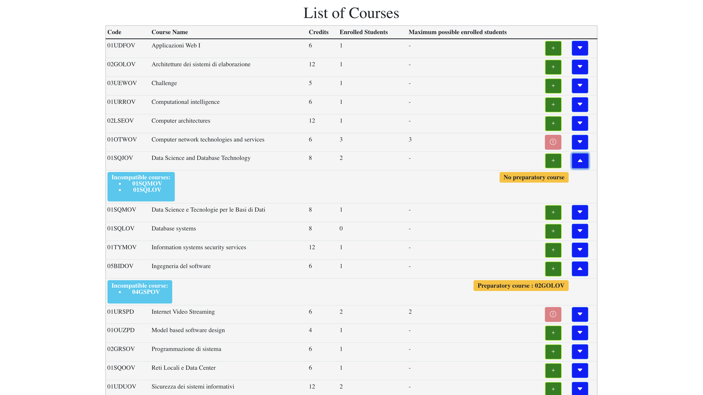

# Exam #1: "StudyPlan"
# Voto: 30L
## Student: s296114 BARLETTA FRANCESCO PIO 

## React Client Application Routes

- Route `/`: User logged/unauthorized see the list of courses
- Route `/studyplan`: If the user is logged, he sees his StudyPlan 
- Route `/login` : Login Page if the user is not logged

## API Server
### Courses
  
- GET `/api/courses`
  - request parameters and request body content: `none`
  - response body content; `200 (success)` with below body structure

  ```
  [
      {
          "code": "01UDFOV",
          "name": "Applicazioni Web I",
          "credits": 6,
          "maxStudents": null,
          "incompatibleCourse": [
              "01TXYOV"
          ],
          "preparatoryCourse": null,
          "signedStudents": 1
      },
      {
          "code": "02GOLOV",
          "name": "Architetture dei sistemi di elaborazione",
          "credits": 12,
          "maxStudents": null,
          "incompatibleCourse": [
              "02LSEOV"
          ],
          "preparatoryCourse": null,
          "signedStudents": 1
      }...
  ]
  ```

- PUT `/api/courses/:code`
  - request parameters and request body content: `none`. Variable `code` is needed in query parameters.
  - response body content: `200 (success)`.

### StudyPlan

- GET `/api/studyplan/:matricola`
  - request parameters and request body content: `none`. Variable `matricola` is needed in query parameters.
  - response body content: `200 (success)` with list of courses in a StudyPlan

- POST `/api/studyplan/`
  - request parameters and request body content: `user & new course to add`.
  - response body content: `201 (success)`.

- DELETE `/api/studyplan/:matricola/:code`
  - request parameters and request body content: `none`. Variable `matricola, code` are needed in query parameters.
  - response body content: `204 (success)`.

### User's StudyPlan

- GET `/api/user/studyplan/:matricola`
  - request parameters and request body content: `none`. Variable `matricola` is needed in query parameters.
  - response body content: `200 (success)` with the type of StudyPlan of the User with `matricola`:

   ```
      [
        {
          "code": "01URROV",
          "name": "Computational intelligence",
          "credits": 6,
          "maxStudents": null,
          "incompatibleCourse": null,
          "preparatoryCourse": null,
          "signedStudents": 1
      },
      {
          "code": "02LSEOV",
          "name": "Computer architectures",
          "credits": 12,
          "maxStudents": null,
          "incompatibleCourse": [
              "02GOLOV"
          ],
          "preparatoryCourse": null,
          "signedStudents": 1
      }...
    ]
    ```

- PUT `/api/user/studyplan/:matricola/:type`
  - request parameters and request body content: `none`. Variable `matricola, type` are needed in query parameters: 

  ```
    {
      "matricola": matricola,
      "type": type
    }
  ```
  - response body content: `200 (success)`.

### Authentication

- GET `/api/sessions/current`
  - request parameters and request body content: `none`
  - response body content: `200 (success)`.

- POST `/api/sessions/`
  - request parameters and request body content: `user credentials`.
  - response body content: `201 (success)`.

- DELETE `/api/sessions/current`
  - request parameters and request body content: `none`.
  - response body content: `204 (success)`.
  
## Database Tables

- Table `Courses` - contains:
  - code
  - name
  - credits
  - maxStudents
  - incompatible
  - preparatory
  - enrolledStudents

- Table `StudyPlan` - contains:
  - matricola
  - code

- Table `UserStudyPlan` - contains:
  - matricola
  - type

- Table `Users` - contains:
  - matricola
  - email
  - password (not in clear)
  - salt
  - name

## Main React Components

- `LoginForm` (in `LoginForm.js`): login component;
- `NavbarCustom` (in `Navbar.js`): component used for Login, Logout and to see the StudyPlan (if logged) and the list of courses; 
- `CourseView` (in `CourseView.js`): component used to see list of courses (and StudyPlan if a user is logged);
- `CourseTable` (in `CourseTable.js`): component used to create the Table of courses;
- `CourseRow` (in `CourseTable.js`): component used for the description of a course and to add a course in the StudyPlan; 
- `StudyPlanTable` (in `StudyPlanTable.js`): component used to see the StudyPlan of a certain user;
- `CourseRow` (in `StudyPlanTable.js`): component used for the description of a course in the StudyPlan; 
- `CourseData` (in `StudyPlanTable.js`): component used for the course data and to remove a course from a StudyPlan; 

## Screenshot





## Users Credentials

- s123456@studenti.polito.it, password 
- s283991@studenti.polito.it, password 
- s292929@studenti.polito.it, password 
- s296114@studenti.polito.it, password 
- s789012@studenti.polito.it, password 
